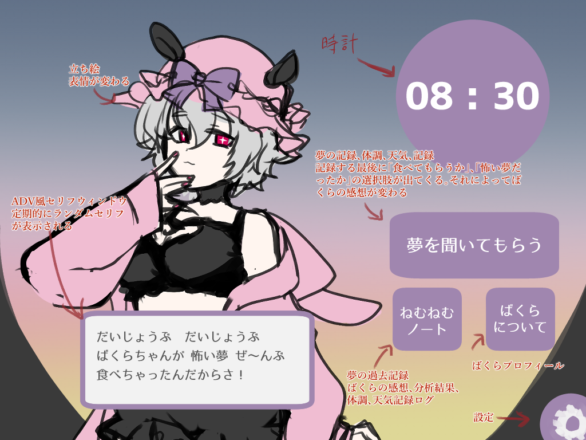
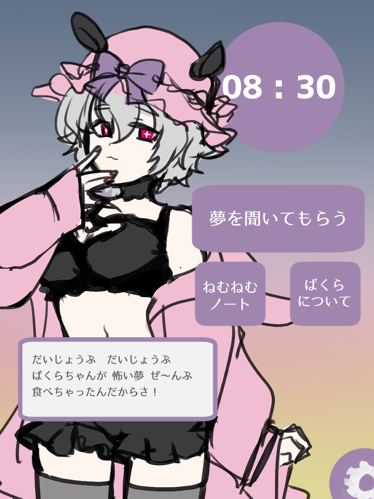

<<<<<<< HEAD

# 夢喰ばくらちゃんとねむねむノート 🌙 — README

---

## 1. サービス概要

悪夢を見た朝、誰かに話したくても話せない不安を、夢喰いキャラクター「ばくらちゃん
」がやさしく受け止めてくれるアプリ。可愛いキャラクターに「食べてもらう」体験を通
じて、悪夢を見た不安を消化して朝を気持ちよく迎えることができる。

---

## 2. このアイデアはどこから生まれたか

### 2-1. きっかけとなった体験・感情

よく悪夢を見た朝に不安な気持ちになることがあります。悪夢を見た日の記録をつけてい
るのですが、自分は特定の夢を見た日に体調を崩していることがわかりました。知人も同
様の悪夢のパターンがあると知り、夢占いの意味など関係なく、偏頭痛や気温気圧のよう
な個人差があるのを感じました。そのため、変な夢を見ると意味を悪い方へ考えてしまっ
たり、また見てしまうかもと不安になってしまうことを解消したいと考え、可愛い女の子
に悪夢を食べてもらって消化してもらうアプリを思いつきました。

### 2-2. なぜそれが「気になった」のか

悪夢を見た朝、誰かに話したくても「こんな変な夢を見た」と言い出せないことがありま
した。怖い夢の内容は人に話しにくく、不安を一人で抱えたまま一日を過ごすことになる
。その感覚がずっと気になっていました。また偏頭痛持ちとして気温・気圧の変化を記録
することで体調を予測できた経験から、「夢も記録すれば何かわかるかもしれない」とい
う発想が自然に生まれました。

## 3. 課題の整理

### 3-1. 表に見えている困りごと

- 悪夢を見て不安なとき、内容によっては吐き出す場所がない

### 3-2. 本当に解決したい課題

- なぜ？→ 怖い夢を見ても内容によっては誰かに話すことができない
- なぜ？→ 不安なまま 1 日を過ごすことでストレスが溜まる
- なぜ？→ 夢日記アプリはあるが、そこから不安を和らげようと感情体験できるツールが
  ない

※ 本当に解決したい課題：

- 悪夢を見た後の不安な気持ちを解消すること

---

## 4. 想定ユーザーについて

### 4-1. 想定しているユーザー

- どういうユーザーなのか：悪夢を頻繁に見るが、夢の内容が怖すぎて・変すぎて誰にも
  話せない人。朝の不安を一人で抱えている人。
- 環境：毎朝スマホを見る習慣がある人
- 理由：起きてすぐ夢を記録できる導線を自然に作れる。

### 4-2. 導入・継続の流れ

- きっかけ：悪夢を見て不安な朝、誰にも話せない
- 最初の一歩：夢の内容を入力 → ばくらちゃんが慰めてくれる
- 続ける理由：悪夢だけでなく、普通の夢や不思議な夢もばくらちゃんに話したくなる愛
  着が生まれる。記録をつけることで「またこの夢を見た...なんでだろう？」と気にな
  り始める
- 本リリースでのゴール：記録が溜まることで「この夢を見るときは体調が悪い」という
  自分だけのパターンがわかり、不安の原因ごと取り除けるようになる

---

## 5. 既存サービス・競合調査

### 5-1. 似たサービスの調査

最も理想に近いアプリ有り

- ゆめ日記
- https://apps.apple.com/jp/app/%E3%82%86%E3%82%81%E6%97%A5%E8%A8%98-%E5%A4%A2%E3%82%92%E8%A8%98%E9%8C%B2-%E5%88%86%E6%9E%90/id6752232946
- 夢の記録、AI による分析、気分の記録、夢のカテゴリーわけ、プライバシー保護機能

### 5-2. それでも自分が作りたい理由

既存アプリや ChatGPT は夢を「分析する」。ばくらちゃんは夢を「食べて消化してくれ
る」。可愛い女の子によしよしと慰めてもらえるという感情体験そのものが、このアプリ
にしかない価値。

### 5-3. 差別化を一文で

悪夢に悩む人が、夢をばくらちゃんに話しかけるだけで不安が和らぐアプリ

## 6. このアプリで実現すること

### MVP で作る機能（7 月リリース）

1. ユーザー登録・ログイン：Devise による認証。テスト用アカウントを用意
2. 夢の記録：夢の内容（テキスト）+ 体調（良い／普通／悪い）+ 天気を入力
3. ばくらちゃんの返答：ADV 風 UI（立ち絵＋セリフ枠）で OpenAI が 1 回返答
4. 夢の種類選択：「怖かった夢」「いい夢」をボタンで選択 → ばくらちゃんのセリフが
   変わる
5. CRUD：夢日記の一覧・詳細・編集・削除

#### ADV 風 UI のイメージ

## PC イメージ

## SP イメージ

### 本リリースで作る機能

- 夢 × 体調 × 天気の相関グラフ
- 「この夢を見たら注意」パターン通知
- 夢の履歴カレンダー表示
- ばくらちゃん好感度機能
- 好感度によってお着替え衣装追加
- 立ち絵アニメーション演出の強化

---

## 7. このアプリの懸念点とその対策

### 懸念点 ①：OpenAI API の学習コスト

- 何が問題になりそうか：RUNTEQ 基礎カリキュラムで習っていない技術のため、実装に
  時間がかかる可能性がある
- なぜそう思うか：Rails × OpenAI API の連携は初挑戦
- 対策：日本語記事が豊富なため、集中的にキャッチアップする。チャット GPT などを
  補助機能として活用する。

- 何が問題になりそうか：OpenAI API が従量課金制のため、ユーザーが増えると API コ
  ストが増大する。
- なぜそう思うか：チャット形式で毎回 API を呼ぶ設計のため、リクエスト数が多くな
  る
- 対策：MVP はユーザー数を限定してテスト。プロンプトを短く設計してトークン数を最
  小化する（コストが比較的に安いモデルは GPT-4o mini を使う、OpenAI ダッシュボー
  ドで利用上限を設定する、トークン数を最小化）

### 懸念点 ②：MVP までに ADV 風のアプリを理想的に動かすようにできるか

- 何が問題になりそうか：全ての機能をつけるのと同時進行で立ち絵などを作成する必要
  があり、ADV 風の動作、配置などの実装に時間がかかる
- なぜそう思うか：初挑戦の技術の挑戦、あまり余裕のないスケジュールのため
- 対策：元々ポートフォリオで作成した HTML のレイアウト、JS の枠を使い、アプリ用
  にデザインを直すことで 1 から作る工程を省略する。

---

## 8. 技術スタック

### 8-1. 使用予定の技術

- フレームワーク：Ruby on Rails
- フロントエンド ：ERB + HTML/CSS
- DB ：PostgreSQL、認証 、Devise、外部 API OpenAI API（GPT-4o） API
- ライブラリ：ruby-openai デプロイ先 ：Render（検討中）

### 8-2. DB 設計

—- users └── dreams 夢を聞いてもらう（夢の投稿） —-

| カラム名        | 型      | 内容                           |
| --------------- | ------- | ------------------------------ |
| user_id         | integer | ユーザーの紐付け               |
| content         | text    | 夢の内容（テキスト）           |
| dream_type      | string  | 最高／普通／最悪               |
| bakura_response | text    | ばくらちゃんの AI 返答（保存） |

### 8-3. 技術選定の理由

- RUNTEQ で学んだ Rails を活用し、確実に 7 月に完成させる
- OpenAI API でキャラクターの返答を自然言語生成する点が今回の技術チャレンジした
  いため
- フロントは ERB でシンプルにまとめ、開発速度を優先する
- ADV 風 UI はポートフォリオでの実装経験を流用できるため工数を削減できる

### ER 図

https://gyazo.com/47c3fe4c21b5fdb3fcee19cf8f5b9f93

- # DB 設計で考えていた項目を参考に作成しています
